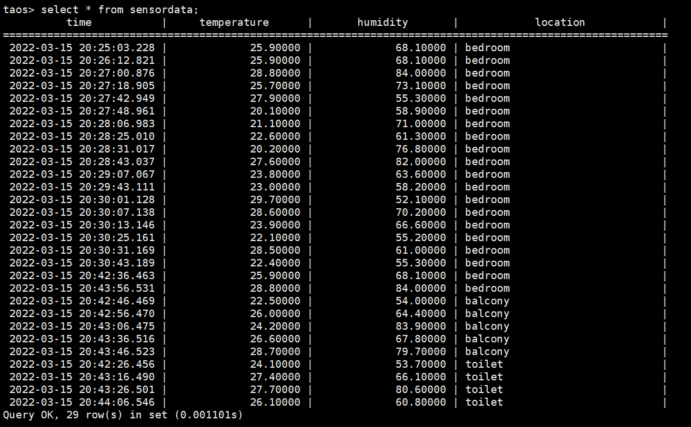

## 安装和启动

Ubuntu 系统使用 apt-get 工具从官方仓库安装

```bash
wget -qO - http://repos.taosdata.com/tdengine.key | sudo apt-key add -
echo "deb [arch=amd64] http://repos.taosdata.com/tdengine-stable stable main" | sudo tee /etc/apt/sources.list.d/tdengine-stable.list
sudo apt-get update
apt-cache policy tdengine
sudo apt-get install tdengine
```

或者

```
wget https://www.taosdata.com/assets-download/TDengine-server-2.2.0.2-Linux-x64.tar.gz
tar -zxvf TDengine-server-2.2.0.2-Linux-x64.tar.gz
cd TDengine-server-2.2.0.2/
sudo ./install.sh
```

启动

```bash
systemctl start taosd
```

执行 TDengine 客户端程序，只要在 Linux 终端执行 taos 即可

```
taos
```

## 设置 fqdn

这里将 TDengine server 节点名设置为 `metaedge.td1`，在此基础之上设置 fqdn

设置 hostname

```
hostnamectl set-hostname metaedge.td1
```

然后重启机器。修改 `/var/lib/taos/dnode/dnodeEps.json`，将 dnodeFqdn 字段设置为 `metaedge.td1`。再重启

```
sudo service taosd restart
```

客户端需要配置 /etc/hosts 里面写入 `server-ip metaedge.td1`

## 与 Kuiper 交互

安装 TDengine 插件，注意当前 TDengine 客户端版本为 2.2.0.2

```bash
curl -d "{\"name\":\"tdengine\",\"file\":\"https://packages.emqx.io/kuiper-plugins/1.4.3/debian/sinks/tdengine_amd64.zip\",\"shellParas\": [\"2.2.0.2\"]}" http://127.0.0.1:9081/plugins/sinks
```

进入 TDengine 客户端，创建 test 用户

```
create user test pass 'test';
```

切换 test 用户，创建数据库和数据表

```
use test;
create database test;

create stable sensordata (time timestamp,temperature float,humidity float) tags (location binary(64));
create table bedroom_sensordata using sensordata tags("bedroom");
create table balcony_sensordata using sensordata tags("balcony");
create table toilet_sensordata using sensordata tags("toilet");

create table sensor (time timestamp,id nchar(20),temperature int,humidity int);
```

创建 device1、device2、device3 三个 stream，分别接收MQTT test/bedroom、test/balcony、test/toilet 主题消息

```bash
kuiper create stream device1 '(temperature float, humidity float) WITH (FORMAT="JSON", DATASOURCE="test/bedroom")'
kuiper create stream device2 '(temperature float, humidity float) WITH (FORMAT="JSON", DATASOURCE="test/balcony")'
kuiper create stream device3 '(temperature float, humidity float) WITH (FORMAT="JSON", DATASOURCE="test/toilet")'
```

编写 demoRule1，demoRule2，demoRule3 规则

```json
# demoRule1
{
    "sql": "SELECT temperature,humidity FROM device1 WHERE isNull(temperature,humidity) = false",
    "actions": [
        {
            "tdengine": {
                "provideTs": false,
                "tsFieldName": "time",
                "port": 0,
                "ip": "127.0.0.1",
                "user": "test",
                "password": "test",
                "database": "test",
                "table": "bedroom_sensordata",
                "fields": [
                    "temperature",
                    "humidity"
                ]
            }
        },
        {
            "log": {}
        }
    ]
}
# demoRule2
{
    "sql": "SELECT temperature,humidity FROM device2 WHERE isNull(temperature,humidity) = false",
    "actions": [
        {
            "tdengine": {
                "provideTs": false,
                "tsFieldName": "time",
                "port": 0,
                "ip": "127.0.0.1",
                "user": "test",
                "password": "test",
                "database": "test",
                "table": "balcony_sensordata",
                "fields": [
                    "temperature",
                    "humidity"
                ]
            }
        },
        {
            "log": {}
        }
    ]
}
# demoRule3
{
    "sql": "SELECT temperature,humidity FROM device3 WHERE isNull(temperature,humidity) = false",
    "actions": [
        {
            "tdengine": {
                "provideTs": false,
                "tsFieldName": "time",
                "port": 0,
                "ip": "127.0.0.1",
                "user": "test",
                "password": "test",
                "database": "test",
                "table": "toilet_sensordata",
                "fields": [
                    "temperature",
                    "humidity"
                ]
            }
        },
        {
            "log": {}
        }
    ]
}
```

创建 demoRule 规则

```bash
kuiper create rule demoRule1 -f demoRule1
kuiper create rule demoRule2 -f demoRule2
kuiper create rule demoRule3 -f demoRule3
```

`kuiper show rules`，查看规则是否处于运行状态

```
Connecting to 127.0.0.1:20498... 
[
  {
    "id": "demoRule1",
    "status": "Running"
  },
  {
    "id": "demoRule2",
    "status": "Running"
  },
  {
    "id": "demoRule3",
    "status": "Running"
  }
]
```

发送 POST 请求
```
curl -X POST \
  http://175.178.163.249:9081/streams \
  -H 'Content-Type: application/json' \
  -d '{
  "sql": "create stream demo (id STRING, temperature BIGINT, humidity BIGINT) WITH (FORMAT=\"JSON\", DATASOURCE=\"zigbee/00000002\")"
}'

curl -X POST \
  http://175.178.163.249:9081/rules \
  -H 'Content-Type: application/json' \
  -d '{
  "id": "rule1",
  "sql": "SELECT id, temperature, humidity FROM demo WHERE isNull(id, temperature, humidity) = false",
  "actions": [
    {
      "tdengine": {
          "provideTs": false,
          "tsFieldName": "time",
          "port": 0,
          "ip": "127.0.0.1",
          "user": "test",
          "password": "test",
          "database": "test",
          "table": "sensor",
          "fields": [
              "id",
              "temperature",
              "humidity"
          ]
      }
    },
    {
      "log": {}
    }
  ]
}'
```

用 Go 编写测试代码（见附录），向 MQTT Broker 发送温度和湿度数据。一段时间过后，在 TDengine 客户端查看接收到的数据

<div align=center>

</div>

## 附录

Go 发送消息测试完整代码：

```go
package main

import (
	"fmt"
	"log"
	"math/rand"
	"os"
	"time"

	mqtt "github.com/eclipse/paho.mqtt.golang"
)

var f mqtt.MessageHandler = func(client mqtt.Client, msg mqtt.Message) {
	fmt.Printf("TOPIC: %s\n", msg.Topic())
	fmt.Printf("MSG: %s\n", msg.Payload())
}

func genPair() (float64, float64) {
	t := (200.0 + float64(rand.Intn(120))) / 10.0
	h := (500.0 + float64(rand.Intn(350))) / 10.0
	return t, h
}

func genLocation() string {
	locations := []string{"bedroom", "balcony", "toilet"}
	i := rand.Intn(3)
	return locations[i]
}

func main() {
	mqtt.DEBUG = log.New(os.Stdout, "", 0)
	mqtt.ERROR = log.New(os.Stdout, "", 0)
	opts := mqtt.NewClientOptions().AddBroker("mqtt://175.178.160.127:1883")

	opts.SetKeepAlive(60 * time.Second)
	opts.SetDefaultPublishHandler(f)
	opts.SetPingTimeout(1 * time.Second)

	c := mqtt.NewClient(opts)
	if token := c.Connect(); token.Wait() && token.Error() != nil {
		panic(token.Error())
	}

	// pub msg loop
	for {
		t, h := genPair()
		payload := fmt.Sprintf("{\"temperature\":%f, \"humidity\":%f}", t, h)
		token := c.Publish("test/"+genLocation(), 0, false, payload)
		token.Wait()
		// wait 10s
		time.Sleep(10 * time.Second)
	}
}
```
