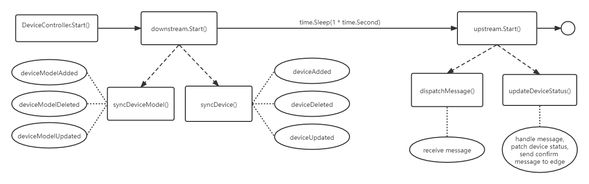

```本文基于 commit 9a7e140b42abb4bf6bcabada67e3568f73964278。```

## 概述

DeviceController 是一个扩展的 k8s 控制器，管理边缘设备，确保设备信息、设备状态的云边同步。

## 模块入口

cloud/pkg/devicecontroller/devicecontroller.go：
```
// Start controller
func (dc *DeviceController) Start() {
	if err := dc.downstream.Start(); err != nil {
		klog.Exitf("start downstream failed with error: %s", err)
	}
	// wait for downstream controller to start and load deviceModels and devices
	// TODO think about sync
	time.Sleep(1 * time.Second)
	if err := dc.upstream.Start(); err != nil {
		klog.Exitf("start upstream failed with error: %s", err)
	}
}
```

Start 分别启动 downstream 和 upstream，同时 upstream 依赖于 downstream。注册 DeviceController 时，downstream 和 upstream 就通过 NewDownstreamController 和 NewUpstreamController 初始化好了。

## downstream

downstream 一般描述云端向边缘端下发数据。

NewDownstreamController 创建了 kubeClient，deviceManager，deviceModelManager，messageLayer，configMapManager 赋值给了 dc 并返回：
```
// NewDownstreamController create a DownstreamController from config
func NewDownstreamController(crdInformerFactory crdinformers.SharedInformerFactory) (*DownstreamController, error) {
	deviceManager, err := manager.NewDeviceManager(crdInformerFactory.Devices().V1alpha2().Devices().Informer())
	if err != nil {
		klog.Warningf("Create device manager failed with error: %s", err)
		return nil, err
	}

	deviceModelManager, err := manager.NewDeviceModelManager(crdInformerFactory.Devices().V1alpha2().DeviceModels().Informer())
	if err != nil {
		klog.Warningf("Create device manager failed with error: %s", err)
		return nil, err
	}

	dc := &DownstreamController{
		kubeClient:         client.GetKubeClient(),
		deviceManager:      deviceManager,
		deviceModelManager: deviceModelManager,
		messageLayer:       messagelayer.NewContextMessageLayer(),
		configMapManager:   manager.NewConfigMapManager(),
	}
	return dc, nil
}
```

downstream 的 Start 方法执行了 dc.syncDeviceModel()，dc.syncDevice() 两个函数：
```
// Start DownstreamController
func (dc *DownstreamController) Start() error {
	klog.Info("Start downstream devicecontroller")

	go dc.syncDeviceModel()

	// Wait for adding all device model
	// TODO need to think about sync
	time.Sleep(1 * time.Second)
	go dc.syncDevice()

	return nil
}
```

syncDeviceModel 调用了 dc.deviceModelManager.Events()，
获取 deviceModelManager 的 events，events 类型为 chan watch.Event，可以理解为 deviceModel 相关的事件到来后会传到通道 events 中。即 syncDeviceModel 从 deviceModelManager 中获取 event 并进行分析。

之后 syncDeviceModel 根据 e.Type 的类型执行不同的操作：
```
switch e.Type {
case watch.Added:
	dc.deviceModelAdded(deviceModel)
case watch.Deleted:
	dc.deviceModelDeleted(deviceModel)
case watch.Modified:
	dc.deviceModelUpdated(deviceModel)
default:
	klog.Warningf("deviceModel event type: %s unsupported", e.Type)
}
```

1. dc.deviceModelAdded(deviceModel) 将 deviceModel 存如表 dc.deviceModelManager.DeviceModel 中；
2. dc.deviceModelDeleted(deviceModel) 将 deviceModel 从表 dc.deviceModelManager.DeviceModel 删除；
3. dc.deviceModelUpdated(deviceModel) 更新表 dc.deviceModelManager.DeviceModel 中的 deviceModel，如果 deviceModel Name 不存在，则直接添加 deviceModel。

syncDevice 与 syncDeviceModel 类似，都是先通过 Events() 获取 events，然后根据 events 的类型执行相应的处理。deviceManager 与 deviceModelManager 也几乎一样。不过收到事件后的处理比 syncDeviceModel 略微复杂，需要发送消息。以 deviceAdded 为例，deviceAdded 首先把 device 存到 dc.deviceManager.Device 中，然后执行 dc.addToConfigMap(device) 和 createDevice(device)，接着执行 messagelayer.BuildResource，msg.BuildRouter 等函数来构建 msg，最后通过 dc.messageLayer.Send(*msg) 将 device 数据发送出去。

### Device Model

Device Model 描述了设备属性，如“温度”或”压力”。Device Model 相当于是模板，使用它可以创建和管理许多设备。spec 中的 properties 字段定义设备通用支持的属性，例如数据类型、是否只读、默认值、最大值和最小值；另外还有 propertyVisitors 字段，它定义每种属性字段的访问方式，例如数据是否需要经过某种运算处理，数据格式转换。以下是一个 Device Model 的例子：

```
apiVersion: devices.kubeedge.io/v1alpha2
kind: DeviceModel
metadata:
 name: sensor-tag-model
 namespace: default
spec:
 properties:
  - name: temperature
    description: temperature in degree celsius
    type:
     int:
      accessMode: ReadWrite
      maximum: 100
      unit: degree celsius
  - name: temperature-enable
    description: enable data collection of temperature sensor
    type:
      string:
        accessMode: ReadWrite
        defaultValue: 'OFF'
```

### Device

Device 代表一个实际的设备对象，可以看作是 Device Model 的实例化。spec 字段是静态的，status 字段中是动态变化的数据，如设备期望的状态和设备报告的状态。以下是一个 Device 的例子：
```
apiVersion: devices.kubeedge.io/v1alpha2
kind: Device
metadata:
  name: sensor-tag-instance-01
  labels:
    description: TISimplelinkSensorTag
    manufacturer: TexasInstruments
    model: CC2650
spec:
  deviceModelRef:
    name: sensor-tag-model
  protocol:
    modbus:
      slaveID: 1
    common:
      com:
        serialPort: '1'
        baudRate: 115200
        dataBits: 8
        parity: even
        stopBits: 1
  nodeSelector:
    nodeSelectorTerms:
    - matchExpressions:
      - key: ''
        operator: In
        values:
        - node1
  propertyVisitors:
    - propertyName: temperature
      modbus:
        register: CoilRegister
        offset: 2
        limit: 1
        scale: 1
        isSwap: true
        isRegisterSwap: true
    - propertyName: temperature-enable
      modbus:
        register: DiscreteInputRegister
        offset: 3
        limit: 1
        scale: 1.0
        isSwap: true
        isRegisterSwap: true
status:
  twins:
    - propertyName: temperature
      reported:
        metadata:
          timestamp: '1550049403598'
          type: int
        value: '10'
      desired:
        metadata:
          timestamp: '1550049403598'
          type: int
        value: '15'
```

## upstream

upstream 一般描述边缘端向云端上传数据。

NewUpstreamController 通过 keclient.GetCRDClient() 创建了 crdClient，另外创建了 messageLayer，除此之外，UpstreamController 还包含了一个 downstream：
```
// NewUpstreamController create UpstreamController from config
func NewUpstreamController(dc *DownstreamController) (*UpstreamController, error) {
	uc := &UpstreamController{
		crdClient:    keclient.GetCRDClient(),
		messageLayer: messagelayer.NewContextMessageLayer(),
		dc:           dc,
	}
	return uc, nil
}
```

upstream 的 Start 方法执行了 uc.dispatchMessage()，uc.updateDeviceStatus() 两个函数：
```
// Start UpstreamController
func (uc *UpstreamController) Start() error {
	klog.Info("Start upstream devicecontroller")

	uc.deviceStatusChan = make(chan model.Message, config.Config.Buffer.UpdateDeviceStatus)
	go uc.dispatchMessage()

	for i := 0; i < int(config.Config.Load.UpdateDeviceStatusWorkers); i++ {
		go uc.updateDeviceStatus()
	}
	return nil
}
```

dispatchMessage 函数主要通过 uc.messageLayer.Receive() 收取数据，放入 uc.deviceStatusChan。

updateDeviceStatus 函数循环执行，收取 uc.deviceStatusChan 的 msg，将 msg 反序列化获得 msgTwin，获取 deviceID，device，cacheDevice，deviceStatus，然后将 deviceStatus 上传，最后向 Edge 返回确认 msg。

## 总结

<div align=center>

</div>
