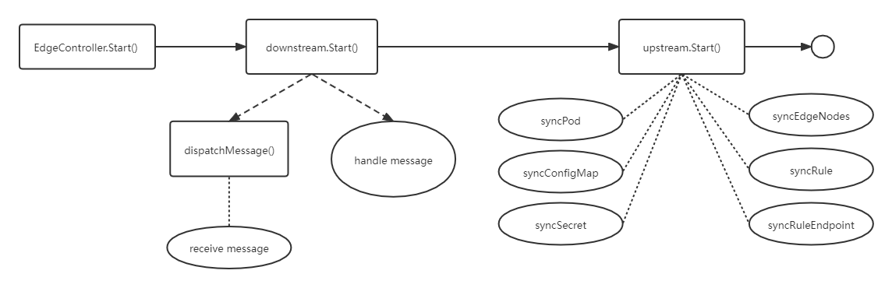

```本文基于 commit 9a7e140b42abb4bf6bcabada67e3568f73964278。```

## 概述

EdgeController 是一个扩展的 k8s 控制器，管理边缘节点和 Pods 的元数据，确保数据能够传递到指定的边缘节点。

## 模块入口

cloud/pkg/edgecontroller/edgecontroller.go：
```
// Start controller
func (ec *EdgeController) Start() {
	if err := ec.upstream.Start(); err != nil {
		klog.Exitf("start upstream failed with error: %s", err)
	}

	if err := ec.downstream.Start(); err != nil {
		klog.Exitf("start downstream failed with error: %s", err)
	}
}
```

Start 分别启动 upstream 和 downstream，upstream 和 downstream 之间没有依赖关系。注册 EdgeController 时，upstream 和 downstream 就通过 NewUpstreamController 和 NewDownstreamController 初始化好了。

## upstream

在 NewUpstreamController 中初始化了所有成员 channel，upstream.Start() 主要就是调用 uc.dispatchMessage() 分发收到的消息，以及执行其他函数用于处理成员 channel 里面的数据。

dispatchMessage 函数不断轮询，调用 uc.messageLayer.Receive() 接受消息，根据收到的消息 resourceType 选择将数据送到对应的 channel 中：
```
switch resourceType {
case model.ResourceTypeNodeStatus:
	uc.nodeStatusChan <- msg
case model.ResourceTypePodStatus:
	uc.podStatusChan <- msg
case model.ResourceTypeConfigmap:
	uc.configMapChan <- msg
case model.ResourceTypeSecret:
	uc.secretChan <- msg
case model.ResourceTypeServiceAccountToken:
	uc.serviceAccountTokenChan <- msg
case common.ResourceTypePersistentVolume:
	uc.persistentVolumeChan <- msg
case common.ResourceTypePersistentVolumeClaim:
	uc.persistentVolumeClaimChan <- msg
case common.ResourceTypeVolumeAttachment:
	uc.volumeAttachmentChan <- msg
case model.ResourceTypeNode:
	switch msg.GetOperation() {
	case model.QueryOperation:
		uc.queryNodeChan <- msg
	case model.UpdateOperation:
		uc.updateNodeChan <- msg
	default:
		klog.Errorf("message: %s, operation type: %s unsupported", msg.GetID(), msg.GetOperation())
	}
case model.ResourceTypePod:
	if msg.GetOperation() == model.DeleteOperation {
		uc.podDeleteChan <- msg
	} else {
		klog.Errorf("message: %s, operation type: %s unsupported", msg.GetID(), msg.GetOperation())
	}
case model.ResourceTypeRuleStatus:
	uc.ruleStatusChan <- msg

default:
	klog.Errorf("message: %s, resource type: %s unsupported", msg.GetID(), resourceType)
}
```

每种 channel 中的消息都由不同的函数来处理，这里以 updateNodeStatus 函数为例，它接收 nodeStatusChan 中的消息，依次 GetContentData，GetNamespace，GetResourceName，GetOperation，根据消息的 Operation 做出相应的操作, 一般是上传到 apiserver：
```
func (uc *UpstreamController) updateNodeStatus() {
	for {
		select {
		case <-beehiveContext.Done():
			klog.Warning("stop updateNodeStatus")
			return
		case msg := <-uc.nodeStatusChan:
			klog.V(5).Infof("message: %s, operation is: %s, and resource is %s", msg.GetID(), msg.GetOperation(), msg.GetResource())

			data, err := msg.GetContentData()
			if err != nil {
				klog.Warningf("message: %s process failure, get content data failed with error: %s", msg.GetID(), err)
				continue
			}

			namespace, err := messagelayer.GetNamespace(msg)
			if err != nil {
				klog.Warningf("message: %s process failure, get namespace failed with error: %s", msg.GetID(), err)
				continue
			}
			name, err := messagelayer.GetResourceName(msg)
			if err != nil {
				klog.Warningf("message: %s process failure, get resource name failed with error: %s", msg.GetID(), err)
				continue
			}

			switch msg.GetOperation() {
			case model.InsertOperation:
				_, err := uc.kubeClient.CoreV1().Nodes().Get(context.Background(), name, metaV1.GetOptions{})
				if err == nil {
					klog.Infof("node: %s already exists, do nothing", name)
					uc.nodeMsgResponse(name, namespace, common.MessageSuccessfulContent, msg)
					continue
				}

				if !errors.IsNotFound(err) {
					errLog := fmt.Sprintf("get node %s info error: %v , register node failed", name, err)
					klog.Error(errLog)
					uc.nodeMsgResponse(name, namespace, errLog, msg)
					continue
				}

				node := &v1.Node{}
				err = json.Unmarshal(data, node)
				if err != nil {
					errLog := fmt.Sprintf("message: %s process failure, unmarshal marshaled message content with error: %s", msg.GetID(), err)
					klog.Error(errLog)
					uc.nodeMsgResponse(name, namespace, errLog, msg)
					continue
				}

				if _, err = uc.createNode(name, node); err != nil {
					errLog := fmt.Sprintf("create node %s error: %v , register node failed", name, err)
					klog.Error(errLog)
					uc.nodeMsgResponse(name, namespace, errLog, msg)
					continue
				}

				uc.nodeMsgResponse(name, namespace, common.MessageSuccessfulContent, msg)

			case model.UpdateOperation:
				nodeStatusRequest := &edgeapi.NodeStatusRequest{}
				err := json.Unmarshal(data, nodeStatusRequest)
				if err != nil {
					klog.Warningf("message: %s process failure, unmarshal marshaled message content with error: %s", msg.GetID(), err)
					continue
				}

				getNode, err := uc.kubeClient.CoreV1().Nodes().Get(context.Background(), name, metaV1.GetOptions{})
				if errors.IsNotFound(err) {
					klog.Warningf("message: %s process failure, node %s not found", msg.GetID(), name)
					continue
				}

				if err != nil {
					klog.Warningf("message: %s process failure with error: %s, namespaces: %s name: %s", msg.GetID(), err, namespace, name)
					continue
				}

				// TODO: comment below for test failure. Needs to decide whether to keep post troubleshoot
				// In case the status stored at metadata service is outdated, update the heartbeat automatically
				for i := range nodeStatusRequest.Status.Conditions {
					if time.Since(nodeStatusRequest.Status.Conditions[i].LastHeartbeatTime.Time) > time.Duration(uc.config.NodeUpdateFrequency)*time.Second {
						nodeStatusRequest.Status.Conditions[i].LastHeartbeatTime = metaV1.NewTime(time.Now())
					}
				}

				if getNode.Annotations == nil {
					getNode.Annotations = make(map[string]string)
				}
				for name, v := range nodeStatusRequest.ExtendResources {
					if name == constants.NvidiaGPUScalarResourceName {
						var gpuStatus []types.NvidiaGPUStatus
						for _, er := range v {
							gpuStatus = append(gpuStatus, types.NvidiaGPUStatus{ID: er.Name, Healthy: true})
						}
						if len(gpuStatus) > 0 {
							data, _ := json.Marshal(gpuStatus)
							getNode.Annotations[constants.NvidiaGPUStatusAnnotationKey] = string(data)
						}
					}
					data, err := json.Marshal(v)
					if err != nil {
						klog.Warningf("message: %s process failure, extend resource list marshal with error: %s", msg.GetID(), err)
						continue
					}
					getNode.Annotations[string(name)] = string(data)
				}

				// Keep the same "VolumesAttached" attribute with upstream,
				// since this value is maintained by kube-controller-manager.
				nodeStatusRequest.Status.VolumesAttached = getNode.Status.VolumesAttached
				if getNode.Status.DaemonEndpoints.KubeletEndpoint.Port != 0 {
					nodeStatusRequest.Status.DaemonEndpoints.KubeletEndpoint.Port = getNode.Status.DaemonEndpoints.KubeletEndpoint.Port
				}

				getNode.Status = nodeStatusRequest.Status

				node, err := uc.kubeClient.CoreV1().Nodes().UpdateStatus(context.Background(), getNode, metaV1.UpdateOptions{})
				if err != nil {
					klog.Warningf("message: %s process failure, update node failed with error: %s, namespace: %s, name: %s", msg.GetID(), err, getNode.Namespace, getNode.Name)
					continue
				}

				nodeID, err := messagelayer.GetNodeID(msg)
				if err != nil {
					klog.Warningf("Message: %s process failure, get node id failed with error: %s", msg.GetID(), err)
					continue
				}

				resource, err := messagelayer.BuildResource(nodeID, namespace, model.ResourceTypeNode, name)
				if err != nil {
					klog.Warningf("Message: %s process failure, build message resource failed with error: %s", msg.GetID(), err)
					continue
				}

				resMsg := model.NewMessage(msg.GetID()).
					SetResourceVersion(node.ResourceVersion).
					FillBody(common.MessageSuccessfulContent).
					BuildRouter(modules.EdgeControllerModuleName, constants.GroupResource, resource, model.ResponseOperation)
				if err = uc.messageLayer.Response(*resMsg); err != nil {
					klog.Warningf("Message: %s process failure, response failed with error: %s", msg.GetID(), err)
					continue
				}

				klog.V(4).Infof("message: %s, update node status successfully, namespace: %s, name: %s", msg.GetID(), getNode.Namespace, getNode.Name)

			default:
				klog.Warningf("message: %s process failure, node status operation: %s unsupported", msg.GetID(), msg.GetOperation())
				continue
			}
			klog.V(4).Infof("message: %s process successfully", msg.GetID())
		}
	}
}
```

## downstream

downstream 的 Start 函数如下：
```
func (dc *DownstreamController) Start() error {
	klog.Info("start downstream controller")
	// pod
	go dc.syncPod()

	// configmap
	go dc.syncConfigMap()

	// secret
	go dc.syncSecret()

	// nodes
	go dc.syncEdgeNodes()

	// rule
	go dc.syncRule()

	// ruleendpoint
	go dc.syncRuleEndpoint()

	return nil
}
```

pod 是最小的，管理，创建，计划的最小单元，包含一个或多个容器；configmap 用于保存配置数据的键值对，可以用来保存单个属性，也可以用来保存配置文件，作用是可以将配置文件与镜像文件分离；secret 与 configmap 类似，但是用来存储敏感信息；node 是 pod 真正运行的主机，可以物理机，也可以是虚拟机；ruleEndpoint 定义了消息的来源，或消息的去向。它包含 3 种类型：rest（云上的一个端点，可以是源端点，用于向边缘发送请求；或者是目标端点，从边缘接收消息）、eventbus（可以是源端点，用于向云发送请求；或者是目标端点，从云接收消息）、servicebus（目标端点，接收云端的消息）；rule 定义了消息如何传输，它包含 3 种类型：rest->eventbus（用户应用调用云上的 rest api 发送消息，最后消息被发送到边缘的 mqttbroker），
eventbus->rest（用户程序向边缘的 mqttbroker 发布消息，最后消息被发送到云上的 rest api），
rest->servicebus（用户程序调用云上的 rest api 发送消息，最后消息被发送到边缘的应用程序）。

syncPod 获取 podManager 中收到的 events，根据 e.Type 分发不同的路由，最后执行dc.messageLayer.Send(*msg) 把数据发送到边缘。

syncConfigMap 获取 configmapManager 中收到的 events，根据 e.Type 设置不同的 operation，最后执行dc.messageLayer.Send(*msg) 把数据发送到边缘。

syncSecret、syncEdgeNodes、syncRule 和 syncRuleEndpoint 函数的流程也类似。

## 总结

<div align=center>

</div>
