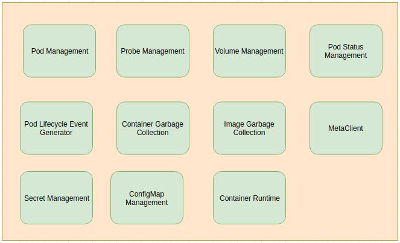
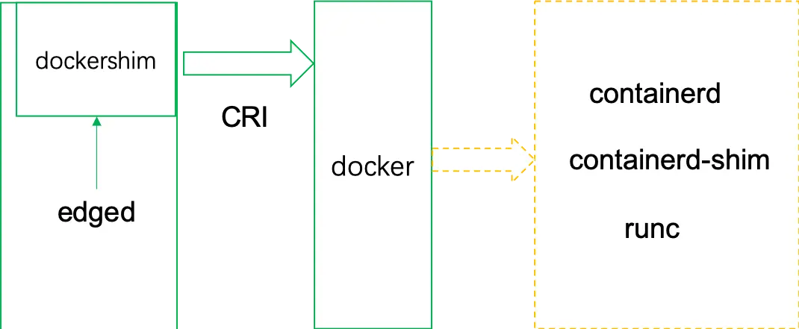

```本文基于 commit 9a7e140b42abb4bf6bcabada67e3568f73964278。```

## 概述

Edged 是运行在边缘节点的代理（轻量化的 kubelet），用于管理容器化的应用程序。Edged 内部模块如图所示：

<div align=center>

</div>

## 代码入口

Edged 的注册和启动过程代码在 edge/pkg/edged/edged.go 中。

Register 调用了 newEdged，newEdged 做了以下事情：
1. 初始化 pod status 管理器
2. 初始化 edged 的 livenessManager、readinessManager、startupManager
3. 创建并启动作为 grpc 服务器运行的 docker shim
4. 初始化运行时服务 runtimeService 和镜像服务 imageService
5. 初始化容器生命周期管理器 clcm
6. 初始化容器日志管理器 logManager
7. 初始化通用容器运行时服务 containerRuntime
8. 创建运行时缓存 runtimeCache
9. 初始化 edged 的镜像存放地 Provider
10. 初始化镜像垃圾回收管理器 imageGCManager
11. 初始化容器垃圾回收器 containerGCManager
12. 初始化 edged 的 server

Start 做了以下事情：
1. 初始化 edged 的 volume plugin 管理器 volumePluginMgr
2. 初始化 edged 节点的模块
3. 新建配置管理器configMapManager
4. 初始化并启动 volume 管理器 volumeManager
5. 启动 edged 的探针管理器 probeManager
6. 启动 pod 状态管理器 statusManager 和 pod 生命周期事件生成器 pleg
7. 启动 pod 增加和删除消息队列
8. 启动 pod 监听事件循环
9. 启动 edged 的 http server
10. 启动镜像和容器的垃圾回收服务
11. 初始化和启动 edged 的插件服务
12. 在 clcm 中启动 CPU 管理器
13. 最后调用 syncPod，启动与 pod 进行事件同步的服务

## edged 与容器运行时

edged 与容器运行时（container runtime）的调用关系可以总结为下图：

<div align=center>

</div>

可以看出 edged 首先启动作为 grpc 服务器运行的 docker shim，然后 edged 通过调用 docker shim 的 grpc server，來实现与容器运行时（container runtime）的交互，最后 docker shim 的 grpc server 将 edged 具体操作传递给容器运行时。

## edged 如何实现边缘自治

首先看 edged 启动时调用的 syncPod，它向 metamanager 发送一条请求（QueryOperation 类型消息），来请求数据库中现有的 pod 信息。然后开始循环接收消息，后面对消息的类型进行判断，类型有 pod、configmap、secret、以及 volume：
```
func (e *edged) syncPod() {
	time.Sleep(10 * time.Second)

	//when starting, send msg to metamanager once to get existing pods
	info := model.NewMessage("").BuildRouter(e.Name(), e.Group(), e.namespace+"/"+model.ResourceTypePod,
		model.QueryOperation)
	beehiveContext.Send(metamanager.MetaManagerModuleName, *info)
	for {
		......
		result, err := beehiveContext.Receive(e.Name())
		......
		switch resType {
		case model.ResourceTypePod:
			if op == model.ResponseOperation && resID == "" && result.GetSource() == metamanager.MetaManagerModuleName {
				err := e.handlePodListFromMetaManager(content)
				if err != nil {
					klog.Errorf("handle podList failed: %v", err)
					continue
				}
				e.setInitPodReady(true)
			} else if op == model.ResponseOperation && resID == "" && result.GetSource() == EdgeController {
				err := e.handlePodListFromEdgeController(content)
				if err != nil {
					klog.Errorf("handle controllerPodList failed: %v", err)
					continue
				}
				e.setInitPodReady(true)
			} else {
				err := e.handlePod(op, content)
				if err != nil {
					klog.Errorf("handle pod failed: %v", err)
					continue
				}
			}
		case model.ResourceTypeConfigmap:
			......
		case model.ResourceTypeSecret:
			......
		case constants.CSIResourceTypeVolume:
			......
		default:
			......
		}
	}
}
```

这里重点关心pod，消息需要通过 result.GetSource() 字段判断来源，可能是 MetaManager 来的，也有可能是 EdgeController 来的。在断网环境下只有可能是 MetaManager 发送的。

handlePodListFromMetaManager 遍历收到的消息中的 pod 内容，调用 addPod 将 pod 全部加入 podAdditionQueue 队列，再调用 updatePodStatus 删除或更新 pod，将 pod status 更新到数据库中：
```
func (e *edged) handlePodListFromMetaManager(content []byte) (err error) {
	var lists []string
	err = json.Unmarshal([]byte(content), &lists)
	if err != nil {
		return err
	}

	for _, list := range lists {
		var pod v1.Pod
		err = json.Unmarshal([]byte(list), &pod)
		if err != nil {
			return err
		}
		if filterPodByNodeName(&pod, e.nodeName) {
			e.addPod(&pod)
			if err = e.updatePodStatus(&pod); err != nil {
				klog.Errorf("handlePodListFromMetaManager: update pod %s status error", pod.Name)
				return err
			}
		}
	}

	return nil
}
```

另外 edged 启动时会调用 podAddWorkerRun，它会在后台不断从 podAdditionQueue 中 get，后面就和 kubelet 一样开始创建容器。

## More

关于 Edged 部分内部模块执行的流程图请见 [Edged](https://kubeedge.io/zh/docs/architecture/edge/edged/)。
