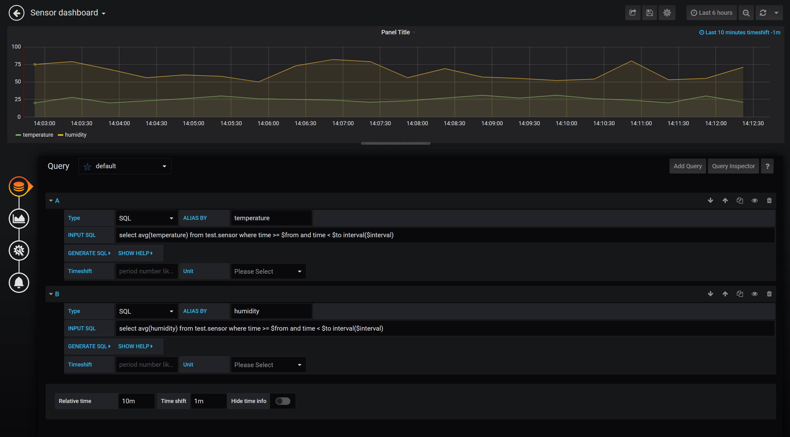

## 安装

```
sudo apt-get install -y adduser libfontconfig1
wget https://dl.grafana.com/oss/release/grafana_6.2.5_amd64.deb
sudo dpkg -i grafana_6.2.5_amd64.deb
```

## 拷贝 TDengine 插件

```
scp -r /usr/local/taos/connector/grafanaplugin/ /var/lib/grafana/plugins
```

之后重启

```
systemctl start grafana-server
```

## 登陆

在浏览器中通过 host:3000 登录 Grafana 服务器，账号为 admin，密码为 admin，登录后需要修改密码

添加数据源为 TDengine，TDengine Host 为 `http://localhost:6041`

## 修改配置

vim /usr/share/grafana/conf/defaults.ini

```
# 允许嵌入
allow_embedding = true

# 允许匿名登录
[auth.anonymous]
enabled = true
```

## 建图表

填写 SQL 与其他字段，图表效果如下

<div align=center>

</div>

## 嵌入 url

```
http://175.178.163.249:3000/d/w-qM3AUnz/sensor-dashboard?orgId=1&panelId=2&kiosk
```
