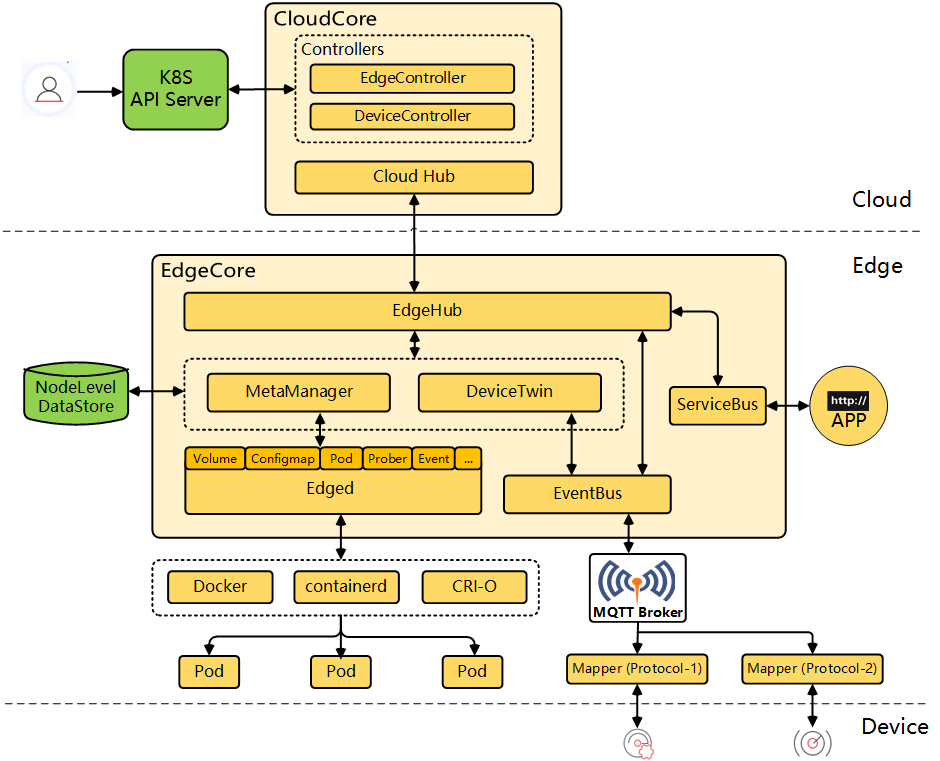

```本文基于 commit 9a7e140b42abb4bf6bcabada67e3568f73964278。```

## KubeEdge 架构图

<div align=center>

</div>

KubeEdge 总体有两大部分 —— cloudcore 和 edgecore。cloudcore 部分是 k8s api server 与 Edge 部分的桥梁，负责将指令下发到 Edge，同时将 Edge 的状态和事件同步到的 k8s api server；edgecore 部分接受并执行 Cloud 部分下发的指令，管理各种负载，并将 Edge 部分负载的状态和事件同步到 Cloud 部分。

### 云上部分

CloudHub 是一个 Web Socket 服务端，负责监听云端的变化，缓存并发送消息到 EdgeHub。

DeviceController 是一个扩展的 k8s 控制器，管理边缘设备，确保设备信息、设备状态的云边同步。

EdgeController 是一个扩展的 k8s 控制器，管理边缘节点和 Pods 的元数据，确保数据能够传递到指定的边缘节点。

### 边缘部分

EdgeHub 是一个 Web Socket 客户端，负责与边缘计算的云端交互，包括同步云端资源更新、报告边缘主机和设备状态变化到云端等功能。

Edged 是运行在边缘节点的代理（轻量化的 kubelet），用于管理容器化的应用程序。

EventBus 是一个与 MQTT 服务器 (mosquitto) 交互的 MQTT 客户端，为其他组件提供订阅和发布功能。

ServiceBus 是一个运行在边缘的 HTTP 客户端。

DeviceTwin 负责存储设备状态（传感器的值等）并将设备状态同步到云 (DeviceController)，它还为应用程序提供查询接口。

MetaManager 是消息处理器，位于 Edged 和 Edgehub 之间，它负责向轻量级数据库 (SQLite) 持久化/检索元数据。

## 关键代码

cloudcore 代码入口为 `Cloud/cmd/cloudcore/cloudcore.go`，在 main 函数中调用 NewCloudCoreCommand，通过  registerModules 函数注册 cloudcore 中的功能模块，通过 StartModules 函数启动已注册的 cloudcore 上的功能模块。registerModules 函数如下：

```
func registerModules(c *v1alpha1.CloudCoreConfig) {
	cloudhub.Register(c.Modules.CloudHub)
	edgecontroller.Register(c.Modules.EdgeController)
	devicecontroller.Register(c.Modules.DeviceController)
	synccontroller.Register(c.Modules.SyncController)
	cloudstream.Register(c.Modules.CloudStream, c.CommonConfig)
	router.Register(c.Modules.Router)
	dynamiccontroller.Register(c.Modules.DynamicController)
}
```

这 7 个模块都实现了 Module 接口，注册最终会将模块封装后的结构体放入一个 map[string]*ModuleInfo 类型的全局变量 modules 中。之后 StartModules 函数通过 for 循环从 modules 获取每一个的模块，每个模块分配一个协程调用 Start 函数启动。

edgecore 代码入口为 `edge/cmd/edgecore/edgecore.go`，在 main 函数中调用 NewEdgeCoreCommand。和在 cloudcore 类似，在 NewEdgeCoreCommand 函数中，通过	registerModules 函数注册 edgecore 中的功能模块，通过 Run 函数启动已注册的 edgecore 中的功能模块。edgecore 中 registerModules 函数注册的模块如下：
```
// registerModules register all the modules started in edgecore
func registerModules(c *v1alpha1.EdgeCoreConfig) {
	devicetwin.Register(c.Modules.DeviceTwin, c.Modules.Edged.HostnameOverride)
	edged.Register(c.Modules.Edged)
	edgehub.Register(c.Modules.EdgeHub, c.Modules.Edged.HostnameOverride)
	eventbus.Register(c.Modules.EventBus, c.Modules.Edged.HostnameOverride)
	metamanager.Register(c.Modules.MetaManager)
	servicebus.Register(c.Modules.ServiceBus)
	edgestream.Register(c.Modules.EdgeStream, c.Modules.Edged.HostnameOverride, c.Modules.Edged.NodeIP)
	test.Register(c.Modules.DBTest)
	// Note: Need to put it to the end, and wait for all models to register before executing
	dbm.InitDBConfig(c.DataBase.DriverName, c.DataBase.AliasName, c.DataBase.DataSource)
}
```

## Why KubeEdge

**为什么用 KubeEdge 而不是 k8s 构建边缘计算平台？**

k8s 构建边缘计算平台的主要挑战：①资源有限。边缘设备可能只有几百兆的内存，一个原生 kubelet 都跑不起来。②网络受限。k8s 的 master 和 node 通信是通过 List/Watch 机制，边缘场景下网络可能会断开很长时间，这时候 node 上的 kubelet 一直 re-watch 失败，就会请求 re-list，把 apiserver 上的对象全量拿回去，没法在边缘场景这种受限的网络下很好的工作。③k8s 节点没有自治能力。如何在网络质量不稳定的情况下，对边缘节点实现离线自治，这也是个问题。

KubeEdge 主打三个核心理念，首先是云边协同，边是云的延伸，用户的边可能位于私有网络，因此需要穿透私有网络，通过云来管理私有节点，KubeEdge 默认采用 WebSocket + 消息封装来实现，这样只要边缘网络能访问外网情况下，就能实现双向通信，这就不需要边端需要一个公网的 IP。同时呢，KubeEdge 也优化了原生 Kubernetes 中不必要的一些请求，能够大幅减少通信压力，高时延状态下仍可以工作。

KubeEdge 第二个核心理念是边缘节点自治，做到节点级的元数据的持久化，比如 Pod，ConfigMap 等基础元数据，每个节点都持久化这些元数据，边缘节点离线之后，它仍可以通过本地持久化的元数据来管理应用。在 Kubernetes 中，当 kubelet 重启后， 它首先要向 master 做一次 List 获取全量的数据，然后再进行应用管理工作，如果这时候边和云端的网络断开，就无法获得全量的元数据，也不能进行故障恢复。KubeEdge 做了元数据的持久化后，可以直接从本地获得这些元数据，保证故障恢复的能力，保证服务快速 ready。

另外一个理念是极致轻量，在大多数边缘计算场景下，节点的资源是非常有限的，KubeEdge 采用的方式是重组 kubelet 组件（~10mb 内存占用），优化 runtime 资源消耗。在空载时候，内存占用率很低。
