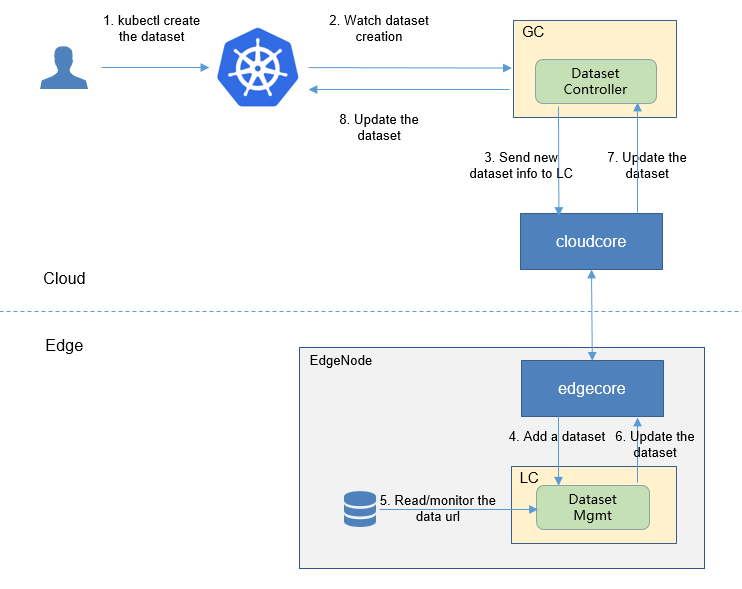

## 安装

KubeEdge 版本需要 v1.8 以上，并且需要保证 EdgeMesh 处于运行状态。

在 cloudcore 上运行

```bash
# SEDNA_ROOT is the sedna directory
export SEDNA_ROOT=/root/sedna
curl https://raw.githubusercontent.com/kubeedge/sedna/main/scripts/installation/install.sh | SEDNA_ACTION=create bash -
```

输出

```
Installing Sedna v0.4.3...
namespace/sedna created
customresourcedefinition.apiextensions.k8s.io/datasets.sedna.io created
customresourcedefinition.apiextensions.k8s.io/federatedlearningjobs.sedna.io created
customresourcedefinition.apiextensions.k8s.io/incrementallearningjobs.sedna.io created
customresourcedefinition.apiextensions.k8s.io/jointinferenceservices.sedna.io created
customresourcedefinition.apiextensions.k8s.io/lifelonglearningjobs.sedna.io created
customresourcedefinition.apiextensions.k8s.io/models.sedna.io created
customresourcedefinition.apiextensions.k8s.io/objectsearchservices.sedna.io created
customresourcedefinition.apiextensions.k8s.io/objecttrackingservices.sedna.io created
service/kb created
deployment.apps/kb created
clusterrole.rbac.authorization.k8s.io/sedna created
clusterrolebinding.rbac.authorization.k8s.io/sedna created
serviceaccount/sedna created
configmap/gm-config created
service/gm created
deployment.apps/gm created
daemonset.apps/lc created
Waiting control components to be ready...
deployment.apps/gm condition met
pod/gm-5bb9c898d6-zc9xc condition met
pod/kb-6b7897c89-dsmns condition met
pod/lc-9l9jz condition met
pod/lc-t922x condition met
NAME                  READY   STATUS    RESTARTS   AGE
gm-5bb9c898d6-zc9xc   1/1     Running   0          4s
kb-6b7897c89-dsmns    1/1     Running   0          4s
lc-9l9jz              1/1     Running   0          4s
lc-t922x              1/1     Running   0          4s
Sedna is running:
See GM status: kubectl -n sedna get deploy
See LC status: kubectl -n sedna get ds lc
See Pod status: kubectl -n sedna get pod
```

## 卸载

在 cloudcore 上运行

```bash
curl https://raw.githubusercontent.com/kubeedge/sedna/main/scripts/installation/install.sh | SEDNA_ACTION=delete bash -
```

## 注意

安装 sedna 时可能会出现 gm and kb 一直处于 pending 状态，这是因为 gm 和 kb 不能容忍主节点上的 taint：

```
# 查看污点，找到 Taints 字段
kubectl describe nodes cloud.kubeedge

# 去除污点 NoSchedule
kubectl taint nodes cloud.kubeedge node-role.kubernetes.io/master:NoSchedule-
```

## 概念
### Dataset

<div align=center>

</div>

dataset crd 中需要设置的字段有 nodeName、url 和 format。nodeName 指定此 dataset crd 由哪个边缘节点管理；url 为 dataset 所在路径，可以是边缘节点本地路径，也可以是共享存储；format 目前只支持 txt 和 csv。

dataset crd 创建后，主要就看 Dataset Manager，它会定时（MonitorDataSourceIntervalSeconds，默认 60s）重复两件事情，一是从 url 中读取数据集，二是通过 websocket 向云端推送状态，状态中包含数据集的行数(numberOfSamples)以及数据集更新的时间(updateTime)。

### Model

model 与 dataset 类似，且创建时不用指定 nodeName，也没有 controller 监控。

model 的信息将在使用该 model 的联邦学习等任务时被同步；当相应的训练/推理工作完成后，model 的状态将被更新。
